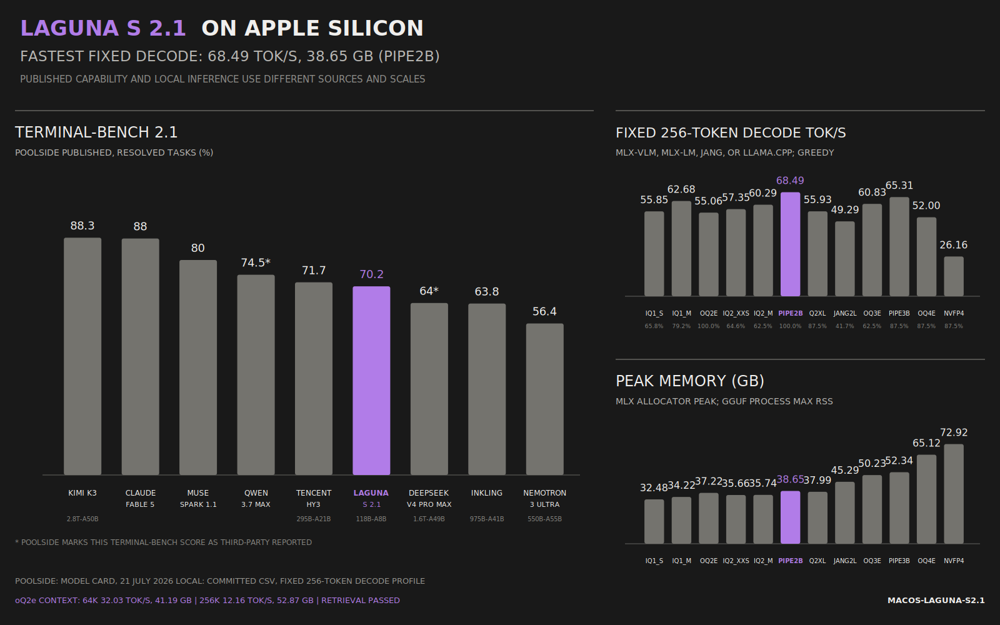

# Laguna S 2.1 MLX benchmark

This repository contains a reproducible local harness for comparing Laguna S 2.1 MLX quantizations on Apple Silicon. Each run records the raw output and task score along with token and prefill throughput, peak MLX memory, load time, package versions, model revision, and machine metadata.

This work was sponsored by [DWS LLC](https://dws.rip).

The new leader on the M5 Max is `pipenetwork/Laguna-S-2.1-MLX-2bit` through MLX-LM. It passed all 38 assertions, averaged 63.86 generation tok/s across the three generation tasks, and reached 68.49 tok/s in the fixed 256-token decode. It needs the conversion's bundled Laguna loader, so the harness loads that file from a pinned revision without modifying the installed MLX-LM package. The measurements are in `BENCHMARK_RESULTS.md`.

## Results at a glance

These results were measured on a 128 GB Apple M5 Max using macOS 27.0, Python 3.13.12, MLX 0.32.0, mlx-vlm 0.6.6, and MLX-LM 0.31.3. The score combines three generation tasks and three agentic coding tasks. Throughput is weighted across the generation tasks.



The left panel reproduces the Terminal-Bench 2.1 figures in [Poolside's model card](https://huggingface.co/poolside/Laguna-S-2.1#benchmark-results). The right panel comes from this repository's committed CSV. They use separate scales and are not the same evaluation. Regenerate the SVG with:

```bash
uv run --frozen laguna-bench chart
```

| Quant | Overall score | Generation | Agentic | Generation tok/s | Peak GB | Suite time |
|---|---:|---:|---:|---:|---:|---:|
| `unsloth/Laguna-S-2.1-GGUF` `UD-IQ1_S` | 0.658 | 0.317 | 1.000 | 63.00 | 32.48 RSS | 65.24s |
| `unsloth/Laguna-S-2.1-GGUF` `UD-IQ2_XXS` | 0.646 | 0.417 | 0.875 | 62.76 | 35.66 RSS | 67.94s |
| `unsloth/Laguna-S-2.1-GGUF` `UD-IQ2_M` | 0.625 | 0.417 | 0.833 | 61.15 | 35.74 RSS | 53.91s |
| `pipenetwork/Laguna-S-2.1-MLX-2bit` | 1.000 | 1.000 | 1.000 | 63.86 | 39.31 | 87.47s |
| `unsloth/Laguna-S-2.1-GGUF` `UD-Q2_K_XL` | 0.875 | 0.750 | 1.000 | 60.37 | 37.99 RSS | 40.17s |
| `unsloth/Laguna-S-2.1-GGUF` `UD-IQ3_XXS` | 0.708 | 0.417 | 1.000 | 55.90 | 42.27 RSS | 57.46s |
| `unsloth/Laguna-S-2.1-GGUF` `UD-IQ3_S` | 0.708 | 0.417 | 1.000 | 56.99 | 46.13 RSS | 63.21s |
| `JANGQ-AI/Laguna-S-2.1-JANG_2L` | 0.417 | 0.417 | 0.417 | 47.79 | 45.75 | 60.53s |
| `pipenetwork/Laguna-S-2.1-MLX-3bit` | 0.875 | 0.750 | 1.000 | 58.63 | 52.88 | 65.82s |
| `mlx-community/Laguna-S-2.1-oQ4e` | 0.875 | 0.750 | 1.000 | 44.42 | 65.70 | 67.07s |
| `mlx-community/Laguna-S-2.1-oQ2e` | 1.000 | 1.000 | 1.000 | 40.85 | 37.77 | 87.38s |
| `unsloth/Laguna-S-2.1-GGUF` `UD-IQ1_M` | 0.792 | 0.750 | 0.833 | 57.34 | 34.22 RSS | 78.41s |
| `mlx-community/Laguna-S-2.1-oQ3e` | 0.625 | 0.417 | 0.833 | 48.58 | 50.69 | 84.79s |
| `poolside/Laguna-S-2.1-NVFP4-mlx` | 0.875 | 0.750 | 1.000 | 7.25 | 73.47 | 301.77s |

Pipenetwork's mixed-precision 2-bit conversion is the best result so far: it matched oQ2e's 38/38 score while improving the fixed decode from 55.06 to 68.49 tok/s. Its standardized profile peaked at 39.90 GB, about 1.4 GB above oQ2e. Unsloth's Q2_K_XL GGUF passed all agentic checks but only two of eight medium-generation assertions, for 0.875 overall and 55.93 tok/s fixed decode. IQ1_M remains the smallest and lowest-memory result, with a lower 0.792 score. The official NVFP4 MLX build was functional but much slower in this runtime.

JANG_2L reproduced its advertised speed class at 49.29 tok/s fixed decode, but scored 0.417 on this suite. Its pinned 2.5.31 runtime also ignored the checkpoint's per-module widths during initial testing; the harness applies those 527 config overrides while loading, without changing the installed package.

Pipenetwork's 3-bit conversion is dominated by its 2-bit sibling here: fixed decode fell from 68.49 to 65.31 tok/s, peak profile memory rose from 39.90 to 53.60 GB, and quality fell from 1.000 to 0.875. Both runs use pinned, separately hashed loader files.

The newly completed oQ4e upload is also dominated: 52.00 tok/s fixed decode, 66.36 GB profile peak, and 0.875 quality. Its extra precision did not fix the medium-generation container error. The later IQ1_S upload is now the smallest tested file at 31.45 GiB, but it drops to 0.658 quality and 55.85 tok/s fixed decode; IQ1_M is the better ultra-low-memory choice. IQ2_XXS and IQ2_M are both heavier, slower, and lower-scoring than IQ1_M, so they are dominated too.

IQ3_XXS recovered a perfect agentic score, but its generation score remained 0.417. At 55.13 tok/s fixed decode and 42.27 GB peak RSS, the smaller IQ1_M and Q2_K_XL are both better tradeoffs. IQ3_S produced exactly the same task scores while decoding at 53.77 tok/s and using 46.13 GB, so its extra precision is strictly dominated here.

Long-context retrieval also passed at every tested size through 256K tokens on oQ2e:

| Prompt tokens | Prefill tok/s | Decode tok/s | Peak MLX GB | Retrieval |
|---:|---:|---:|---:|---:|
| 1,016 | 1411.42 | 60.86 | 37.23 | pass |
| 16,376 | 1613.07 | 52.48 | 38.46 | pass |
| 65,528 | 1088.75 | 32.03 | 41.19 | pass |
| 131,064 | 771.80 | 23.48 | 45.09 | pass |
| 262,136 | 566.31 | 12.16 | 52.87 | pass |

For the fastest tested coding path, use pipenetwork's 2-bit build through `--engine mlx-lm-custom` at its pinned revision. For a conversion that needs no bundled Python loader, oQ2e through in-process mlx-vlm remains the conservative default. The longer context and hyperparameter search below still applies to oQ2e; the new 2-bit build has passed the 16K retrieval case and is queued for the full context sweep.

The full [benchmark report](BENCHMARK_RESULTS.md) includes the standardized quant profile, sampling search, KV cache and prefill search, engine bake-off, revisions, and compatibility failures. The machine-readable source is [the combined CSV](results/laguna_s21_full_results.csv).

## Clone and run

The helper creates the environment and defaults to oQ2e, the fastest tested conversion that uses only the stock mlx-vlm loader:

```bash
git clone https://github.com/tanishq-dubey/macos-laguna-s2.1.git laguna-s21-bench
cd laguna-s21-bench
scripts/laguna.sh download
scripts/laguna.sh prompt 'Write a Python LRU cache with tests'
```

Start an interactive chat or a local OpenAI-compatible server:

```bash
scripts/laguna.sh chat
scripts/laguna.sh server
```

The server binds to `127.0.0.1:8080`. Set `LAGUNA_MODEL`, `LAGUNA_HOST`, or `LAGUNA_PORT` to change the defaults. For example:

```bash
LAGUNA_MODEL=mlx-community/Laguna-S-2.1-oQ3e scripts/laguna.sh server
```

The suite has six fixed tasks:

| Kind | Tier | What it measures |
|---|---|---|
| generation | small | exact structured-output instruction following |
| generation | medium | single-function Python synthesis against hidden tests |
| generation | large | larger algorithm/module synthesis against hidden tests |
| agentic | small | inspect files, derive an answer, and write an artifact |
| agentic | medium | diagnose and repair a tested Python bug |
| agentic | large | implement a multi-file feature and satisfy tests |

Generation uses greedy decoding (`temperature=0`) with a fixed MLX seed. Each agent task starts in a fresh temporary workspace. The agent has access only to an allowlist of tools, and the harness records every turn. Task prompts and tests are versioned in source. Here, "deterministic" means that the decoding settings and fixtures are repeatable. Metal kernels and new model or runtime revisions can still change the results.

`--agent-prompt-cache` enables experimental MLX KV reuse. It improves throughput within each turn, but mlx-vlm 0.6.6 changed a greedy Laguna trajectory during testing because Laguna mixes global caches with rotating sliding-window caches. The option stays off by default until cold and cached runs produce exactly the same output.

## Setup

```bash
uv sync --extra dev --python 3.13 --locked
```

The stock-loader path uses `mlx-vlm`, even though these are text-only models.

Some newer conversions instead bundle a model definition for MLX-LM. The harness exposes those as the explicit `mlx-lm-custom` engine, pins the Hub revision, records the loader's SHA-256 digest, and never copies remote code into the installed package.

JANG support is locked from the upstream Git repository at commit `ca75f0cb`. Use `--engine jang` with a pinned model revision; uv installs the native MLX runtime from the lockfile.

## Run

List tasks and the curated quant ladder:

```bash
uv run --frozen laguna-bench list
```

Run the complete suite on the smallest quant:

```bash
uv run --frozen laguna-bench run \
  --model mlx-community/Laguna-S-2.1-oQ2e \
  --output results
```

Run a cheap smoke test first:

```bash
uv run --frozen laguna-bench run \
  --model mlx-community/Laguna-S-2.1-oQ2e \
  --task generation-small \
  --output results
```

Every run creates `results/<timestamp>-<model>/run.json`, a readable `summary.md`, the raw generations, and the final agent workspaces. A failed task counts as a benchmark result and does not cause the CLI itself to fail. A model or runtime failure does.

Run the current fastest quant with its reviewed custom loader:

```bash
export LAGUNA_MODEL=pipenetwork/Laguna-S-2.1-MLX-2bit
export LAGUNA_ENGINE=mlx-lm-custom
export LAGUNA_REVISION=5a67ae47cdc38ec7d16a09f9efb7add1bb631131
scripts/laguna.sh download
scripts/laguna.sh bench
```

Compare the latest complete run for every tested model:

```bash
uv run --frozen laguna-bench compare --output results
```

Run the standardized short profile for a new quant or the complete context and hyperparameter matrix:

```bash
uv run --frozen laguna-bench sweep --model mlx-community/Laguna-S-2.1-oQ3e --profile quant
scripts/laguna.sh community
```

The full profile covers 256 to 262,144 input tokens, decodes from 64 to 1,024 tokens, three sampling configurations, uniform and TurboQuant KV cache options, a fixed KV window, and several prefill chunk sizes. The 256K case takes several minutes on the reference M5 Max. To export the catalog, task results, and performance records to one CSV, run:

```bash
uv run --frozen laguna-bench export --output results
```

The output is `results/laguna_s21_full_results.csv`. Raw generations and error details remain in the adjacent JSON artifacts.

The harness can also benchmark a local `llama-server` (including Poolside's DFlash build) through its OpenAI-compatible endpoint:

```bash
uv run --frozen laguna-bench run \
  --engine openai \
  --base-url http://127.0.0.1:8080/v1 \
  --model laguna \
  --output results
```

## Quant ladder for this 128 GB Mac

Sizes are repository payloads observed on 2026-07-21 and 2026-07-22 and should be refreshed before downloading:

1. `unsloth/Laguna-S-2.1-GGUF` UD-IQ1_S: 31.45 GiB, smallest tested build, with substantial quality loss
2. `unsloth/Laguna-S-2.1-GGUF` UD-IQ1_M: 33.19 GiB, better low-memory tradeoff than IQ1_S
3. `mlx-community/Laguna-S-2.1-oQ2e`: 33.74 GiB, calibrated 2.70 bpw and the stock-loader quality default
4. `unsloth/Laguna-S-2.1-GGUF` UD-IQ2_XXS: 34.64 GiB, tested and dominated
5. `unsloth/Laguna-S-2.1-GGUF` UD-IQ2_M: 34.71 GiB, tested and dominated by IQ1_M
6. `pipenetwork/Laguna-S-2.1-MLX-2bit`: 35.17 GiB, mixed 2/4/8-bit and the fastest perfect-score result so far
7. `unsloth/Laguna-S-2.1-GGUF` UD-Q2_K_XL: 36.96 GiB, perfect agentic score but weaker medium generation
8. `unsloth/Laguna-S-2.1-GGUF` UD-IQ3_XXS: 41.24 GiB, perfect agentic score but dominated overall
9. `JANGQ-AI/Laguna-S-2.1-JANG_2L`: 41.26 GiB, native MLX speed but poor suite quality
10. `unsloth/Laguna-S-2.1-GGUF` UD-IQ3_S: 45.10 GiB, same quality as IQ3_XXS but slower and larger
11. `mlx-community/Laguna-S-2.1-oQ3e`: 45.86 GiB, lower quality in this suite
12. `pipenetwork/Laguna-S-2.1-MLX-3bit`: 47.93 GiB, slower and lower-scoring than its 2-bit sibling
13. `mlx-community/Laguna-S-2.1-oQ4e`: 59.73 GiB, tested and dominated by the smaller 2-bit build
14. `poolside/Laguna-S-2.1-NVFP4-mlx`: 66.97 GiB, official testing-only build; functional but slow on this runtime
15. `poolside/Laguna-S-2.1-GGUF` Q4_K_M: 70.01 GiB, functional through Poolside's llama.cpp branch

The Vontra and pipenetwork 4-bit MLX conversions both fail to load in mlx-vlm 0.6.6, each because of a different router or quantization incompatibility. We did not download their 6-bit derivatives after those failures. The 116.34 GiB 8-bit conversions leave too little headroom for weights, the KV cache, and macOS on a 128 GB machine. The CSV still includes every variant and records each failure or omission explicitly.

## Contributing results from your Mac

Results from other Apple Silicon machines are welcome. The harness records the chip, memory, macOS version, model revision, and runtime versions, then merges your rows into the committed CSV without removing earlier community results.

First, fork the repository on GitHub and clone your fork. Install [uv](https://docs.astral.sh/uv/) if needed, then create a branch and sync the locked environment:

```bash
git clone https://github.com/<your-user>/macos-laguna-s2.1.git
cd macos-laguna-s2.1
git switch -c results/<model>-<chip>
uv sync --extra dev --python 3.13 --locked
```

The reference oQ2e model is a 33.74 GiB download and peaked near 38 GB in the short suite. Make sure your Mac has enough unified memory and free disk space before starting. Download the default model and reproduce the six quality tasks plus the standardized quant profile:

```bash
scripts/laguna.sh download
scripts/laguna.sh bench
```

To test a stock mlx-vlm conversion, set `LAGUNA_MODEL` for both commands:

```bash
export LAGUNA_MODEL=mlx-community/Laguna-S-2.1-oQ3e
scripts/laguna.sh download
scripts/laguna.sh bench
```

For a conversion with a reviewed bundled MLX-LM loader, also set its engine and pin its revision:

```bash
export LAGUNA_MODEL=pipenetwork/Laguna-S-2.1-MLX-2bit
export LAGUNA_ENGINE=mlx-lm-custom
export LAGUNA_REVISION=5a67ae47cdc38ec7d16a09f9efb7add1bb631131
scripts/laguna.sh download
scripts/laguna.sh bench
```

For the complete context, sampling, KV cache, and prefill matrix, run the community profile. It reaches 256K input tokens and can take several minutes per long case on the reference M5 Max:

```bash
LAGUNA_MODEL=mlx-community/Laguna-S-2.1-oQ2e scripts/laguna.sh community
```

Review the comparison, refresh the merged CSV, and run the tests before committing:

```bash
uv run --frozen laguna-bench compare --output results
uv run --frozen laguna-bench export --output results
uv run --frozen pytest -q
git diff -- results/laguna_s21_full_results.csv
```

Raw run directories stay local because they are large and can contain machine-specific paths. Add the combined CSV to your pull request. Update `BENCHMARK_RESULTS.md` only when your run adds a finding that needs explanation.

```bash
git add results/laguna_s21_full_results.csv
git commit -m "Add <chip> results for <model>"
git push -u origin HEAD
gh pr create --fill
```

In the pull request, briefly mention your Mac model, chip, unified memory, macOS version, and whether the run was plugged in and otherwise idle. Do not edit or delete existing CSV rows by hand. Load failures are useful results too: the harness records them as failure rows so compatibility gaps remain visible.

## Safety

The agent can list, read, and write files only inside its disposable task workspace. It can also invoke the fixture's fixed pytest command. Generation graders execute model-produced Python in a temporary directory with a timeout, but this does not provide a hardened OS sandbox. Run only models you trust, and keep sensitive data on the machine backed up.
